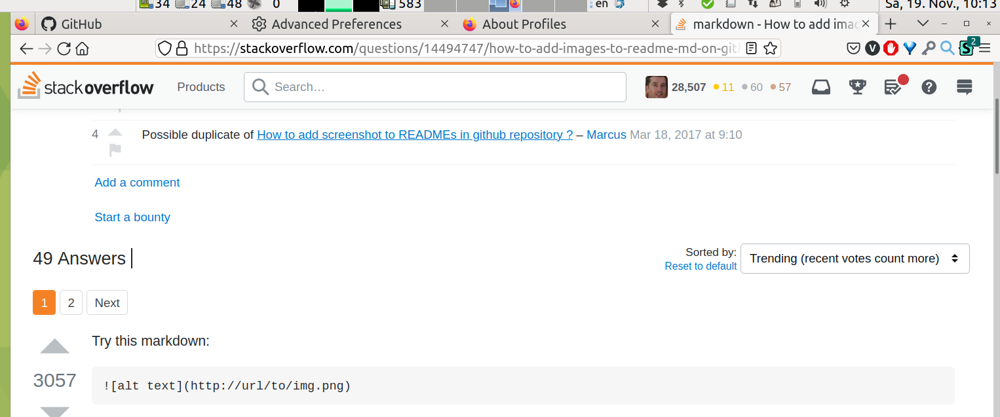

# Ultra compact Firefox Tabs Toolbar layout

While Mozilla works on designing and redesigning their browser, for me it is just a tool, which should help me get things done and otherwise stay out of the way. By default Firefox wastes a lot of precious (especially on 16:9 notebooks) screen height. The standard layout uses 67px for the Tab Bar and 129px in total for the tabs bar and url bar. With some effort you can activate their `compact` mode. But for me it still not compact enough, using 54px and 105px respectively.

Fortunately the Firefox UI is highly customizable with JavaScript and even just CSS. So I prepared the "ultra compact" bar design:

Screenshot is made on Ubuntu Mate 22.04, with Firefox Title Bar deactivated (right click on toolbar > customize > s. checkbox in the down left corner). Tabs bar takes 31px, together with url bar 81px.

## Installation instructions

In your Firefox open `about:config`, search for `toolkit.legacyUserProfileCustomizations.stylesheets` and set it to `true` (just double click on the value)

In your Firefox open `about:profiles` and open the "root" directory for your current Firefox profile. Create `chrome` subfolder, if it does not exist. And save the custom `userChrome.css` to that folder. On github you can open the file, click on `raw` view, then "save as" to the above mentioned folder.

## Compatibility

Firefox 106 (in 2022) has changed a lot of things. This customization is tested to work with this version.
